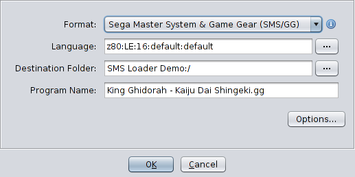

## Ghidra Sega Master System and Game Gear Loader

A simple (WIP) loader for Ghidra for Sega Master System and Game Gear files. Currently able to:
- detect SMS/GG files based on the game header
- set CPU to z80 
- start disassembly/decompilation at byte 0

Missing:
- support for ROM mapping
- specifying RAM as mirrored from another section of RAM

## Screenshots

Loader screenshot  

Disassembly View w/Decompiler  

## Building
- ``export GHIDRA_INSTALL_DIR=<Absolute path to Ghidra>``.
- ``gradle``
- The output zip file will be created within `/dist`

## Installation
- Copy the zip file to ``<Ghidra install directory>/Extensions/Ghidra``.
- Start Ghidra and use the "Install Extensions" dialog to finish the installation. (``File -> Install Extensions...``).

## Credits
- [Adubbz/Ghidra-Switch-Loader](https://github.com/Adubbz/Ghidra-Switch-Loader)
- [andr3colonel/ghidra_wasm](https://github.com/andr3colonel/ghidra_wasm)
- [Writing a wasm loader for Ghidra](https://habr.com/en/post/443318/)

